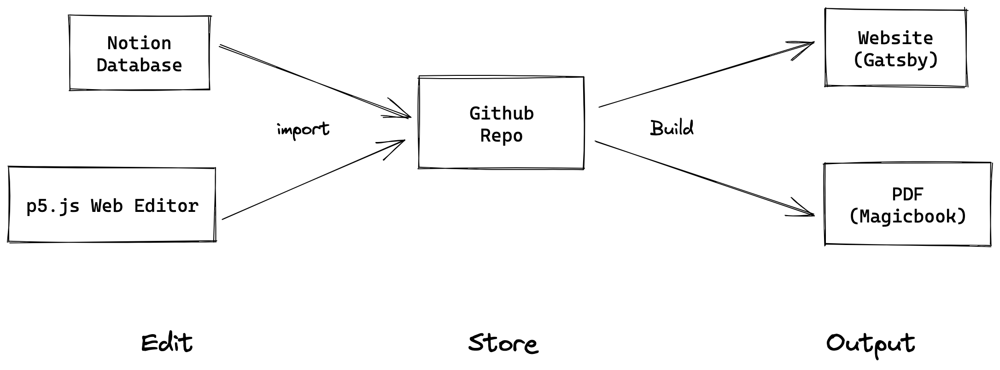

# The Nature of Code (2024 p5.js edition!)

This repository contains all the files for [The Nature of Code book](https://natureofcode.com/). The source content for the book is stored in a private Notion database and imported here as raw HTML files, which are then used to build the print PDF and Gatsby website.

If you are looking for the 2012 edition of The Nature of Code book, [the website is archived here](https://noc-processing-archive.netlify.app/) along with the [GitHub source archive](https://github.com/nature-of-code/Nature-of-Code-Website-Archive).

## Errata

The [Errata page](https://github.com/nature-of-code/noc-book-2/blob/main/errata.md) tracks all uncorrected errors in the print edition since the publication date (September 3, 2024). If you would like to submit an error, please [open an issue](https://github.com/nature-of-code/noc-book-2/issues). All corrections must go through the Notion database, so unfortunately pull requests cannot be accepted.

## Exercise Solutions

The book includes open-ended exercises that invite multiple creative solutions. If you'd like to submit your solution, please [open an issue](https://github.com/nature-of-code/noc-book-2/issues) on GitHub, including the exercise number and a link to your p5.js sketch. To ensure consistency across the website, set your sketch dimensions to `createCanvas(640, 240)`. Whenever possible, avoid using external HTML elements or non-p5.js functions.

If your sketch is selected for the website, it will be re-saved under the Nature of Code web editor account. Be sure to include your name and URLs in the code comments so you can be properly credited!

There is also a [showcase on the Coding Train website](https://thecodingtrain.com/tracks/the-nature-of-code-2), where you can submit creative interpretations of the book content and exercises.

## Example Ports to Other Languages

The website includes a [page with ports of the examples to other languages and environments](https://natureofcode.com/resources/#ports-of-code-examples-to-other-languages).

If you would like to add a resource to this list, please [open an issue](https://github.com/nature-of-code/noc-book-2/issues) with the links and information related to your port.

## Book Build Process



### Edit & Import


Content is stored in a Notion database with the following attributes:

- Type (`Page` | `Chapter`): handled differently during builds, currently only used in the website build.
- Title: defines the title
- Status (`Draft` | `Published`): only `Published` content will be imported
- File Name: defines the page sequence in a PDF build
- Slug: defines the path in the web page URL

Each entity also contains a page of its content, which is transformed into `html` files based on the [schema](docs/import-schemes.md). The transformation script ([nature-of-code/fetch-notion](https://github.com/nature-of-code/fetch-notion)) is written in Node.js and utilized as a GitHub action.

### Build

The following steps describe how to build the book and website. However, you will need to skip the `import-notion-docs` step, as it requires the Notion API key associated with the book. You can find the latest HTML version of the book in `/content`.

```bash
# Install Dependencies
npm install

# Build PDF (Magicbook) in `build` directory
npm run build:pdf

# Build Website in `public` directory
npm run build
```

### Attributions

Icons used in this project:

🖍️ (Crayon), 🦜 (Parrot), and 🔎 (Magnifying glass) from [OpenMoji](https://openmoji.org/) – [CC BY-SA 4.0](https://creativecommons.org/licenses/by-sa/4.0/#)
